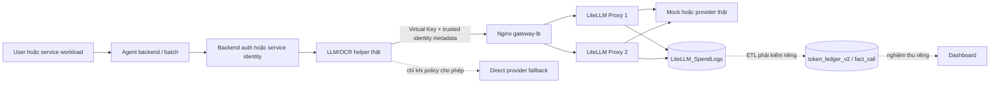

# Báo cáo hợp nhất kiểm thử API Gateway — 4 agent

## 1. Kết luận và phạm vi

Báo cáo này tổng hợp bằng chứng cho bốn agent theo cùng một khung: luồng gọi thật, nguồn identity, routing qua Gateway, fault/recovery, accounting và giới hạn của từng tầng test.

| Agent | Bằng chứng mạnh nhất | Kết luận trong phạm vi đã test |
|---|---|---|
| **TLA-HĐ** | Authenticated OCR seam + actual OCR helper qua Nginx LB/hai LiteLLM Proxy mock | Text và OCR Gateway mock PASS; OCR fail-closed khi LB mất; chưa Google-real OCR hoặc ledger/dashboard |
| **Ralli AI** | Authenticated multipart OCR seam; actual helper qua LB/hai Proxy mock; text helper qua Google thật | Text mock/provider-real và OCR mock PASS; OCR không rơi sang Google/Tesseract khi Gateway lỗi; chưa Google-real OCR hoặc persistence E2E |
| **DMS Feedback** | Endpoint thật `POST /api/classify/text` qua Gateway tới Google | App/provider-real PASS với service identity và tag isolation; chưa per-user JWT hoặc fault matrix đầy đủ |
| **CRM Classification** | Actual batch/helper qua Gateway/provider thật; Gateway outage và checkpoint/recovery | Provider-real, direct fallback và resume PASS trong harness; chưa full scheduled pipeline vì đã chặn SharePoint/Excel/email |

**Không agent nào được chứng nhận production-ready từ báo cáo này.** Chưa có nghiệm thu chung trên deployment candidate VM/LAN, TLS/allowlist, toàn tuyến `LiteLLM_SpendLogs → token_ledger_v2 → dashboard`, hoặc Cloud Billing Export BigQuery.

Các workload khác tầng, thời điểm và provider không được cộng thành một benchmark bốn agent. Đặc biệt, OCR 5/5 là run riêng, không cộng vào text mock 93/93.

## 2. Khung bằng chứng dùng trong báo cáo

| Tầng | Chứng minh được | Không chứng minh được |
|---|---|---|
| **E1 — Unit/scope** | ContextVar, identity, classifier lỗi, retry/fallback, cancellation | Gateway/Proxy/provider đã chạy |
| **E2 — Authenticated ASGI** | JWT/RBAC/router và scope backend; một số dependency có thể mock | Full live E2E tới provider và persistence |
| **E3 — Gateway transaction/fault** | Helper thật → LB/Proxy; routing, fault và `LiteLLM_SpendLogs` được đối soát; upstream có thể mock | Application ledger/ETL hoặc provider-real nếu upstream là mock |
| **E4 — Provider-real helper** | Helper/batch gọi provider thật qua Gateway hoặc direct route | UI/auth/persistence đều thật trong cùng lượt |
| **E5 — App-level E2E** | Endpoint hoặc batch path ứng dụng thật tới provider | Toàn bộ side effect production và dashboard đã nghiệm thu |
| **E6 — Application persistence/ledger** | Application DB, ETL và `fact_call`/`token_ledger_v2` đã được persist, đọc và đối soát | Cloud Billing Export đã khớp |
| **E7 — Cloud billing** | Billing Export được query và đối soát theo project/model/time window | Không thể suy ra từ SpendLogs |

Quy ước:

- **PASS** chỉ áp dụng ở đúng tầng ghi trong bảng.
- **Chưa kiểm chứng** nghĩa là không có bài test tương ứng, không phải FAIL.
- **Mock upstream** không được gọi là provider-real.
- Usage object dựng trong memory không được gọi là application DB persistence.

## 3. Luồng kỹ thuật chung



Ba chiều định danh được giữ riêng:

1. **Virtual Key/tag** xác định agent/application và route được phép gọi.
2. **Trusted request identity** xác định actor backend hoặc service account. TLA-HĐ/Ralli đã xác minh cả `X-User` và body `user`; DMS/CRM mới xác minh `X-User → end_user`, không suy diễn rằng body `user` đã có.
3. **Company/unit/department/project** đến từ catalog/backend mapping; không suy từ IP, tên key hoặc dữ liệu client gửi lên.

Ma trận fault chuẩn:

1. Baseline qua LB.
2. Dừng một Proxy để kiểm LB failover.
3. Khôi phục Proxy và gọi lại.
4. Dừng toàn LB để kiểm policy ứng dụng: fail-closed hoặc direct fallback đã phê duyệt.
5. Khôi phục LB và gọi lại cùng modality.
6. Đối soát response ID, identity, token và SpendLogs; request lỗi không được tính thành usage thành công.

## 4. TLA-HĐ — Law Insight

### 4.1 Luồng đã kiểm

```text
JWT + knowledge:upload
→ POST /api/kb/upload
→ backend trusted identity snapshot
→ token_usage_context / ContextVar
→ PDF scan render thành PNG
→ multimodal chat completion
→ gateway-lb
→ LiteLLM Proxy 1/2
→ upstream mock
→ LiteLLM_SpendLogs
```

Trong Gateway mode:

- `X-User` và JSON body `user` lấy từ backend context.
- Plain HTTP chỉ được phép với loopback; endpoint ngoài loopback phải dùng HTTPS.
- Thiếu identity, lỗi Gateway hoặc LB down đều fail-closed.
- Không rơi sang Gemini SDK, LlamaParse, pdfplumber, PyMuPDF hoặc Marker.
- Khi một trang OCR lỗi, sibling tasks được cancel và drain trước khi trả lỗi.
- Background worker chụp identity trước khi request kết thúc rồi mở scope riêng khi chạy.

Direct mode legacy vẫn tồn tại, nhưng không được dùng làm fallback ngầm trong Gateway mode.

### 4.2 Kết quả

| Tầng/bài test | Kết quả | Ranh giới |
|---|---:|---|
| Text focused application | **140 passed**, 19 warnings | Lịch sử trước đợt OCR |
| Text fault/fallback | **20/20 stage PASS** | Mock transport/provider |
| Text LB/accounting | **93/93 request = 93/93 SpendLogs**, 8 synthetic users, 2.790 mock tokens | Closed-loop mock, không phải capacity benchmark |
| OCR focused regression | **86/86 PASS**, 0 failures/errors/skips | JUnit artifact |
| OCR authenticated ASGI | **PASS** | JWT decoder, permission dependency, router/scope và OCR seam thật; permission lookup, DB/storage/audit/downstream mock |
| OCR LB/fault run | **5/5 successful request = 5/5 SpendLogs**, 150 mock tokens | Upstream mock; artifact `law-ocr-0bb0c8d15e0c` |

OCR fault run gồm hai baseline, một request khi một Proxy down, một request sau Proxy recovery và một request sau LB recovery. Khi toàn LB down, helper trả `InternalServerError`, không direct fallback và không tạo successful usage row. Cả hai Proxy có traffic; Virtual Key tạm được xóa (`DELETE 200`, readback `404`).

### 4.3 Revision và bằng chứng

- Repo/branch: `law_insight`, `api-gateway`.
- OCR commit local: `39b9a719e614a8e8702282932282ff24aab25091`.
- Base trước OCR: `b8e53c911c75fbbd75c5e1eda446dae2942bd44b`.
- [OCR fault artifact](./law-ocr-0bb0c8d15e0c.json)
- [OCR JUnit 86/86](./law-ocr-focused-tests-20260916.xml)
- [OCR LB harness](./law_ocr_lb_test.py)
- [Text fallback 20/20](./law-fallback-e3cee80a23d0.json)
- [Text LB/SpendLogs 93/93](./law-lb-815c700c6af2.json)

`law-ocr-aa17bd4e467e.json` và `law-ocr-7ca50d40fe27.json` là artifact lịch sử, không phải kết quả hiện hành.

### 4.4 Chưa kiểm chứng

- Google/Gemini-real OCR và provider outage trên đường OCR thật.
- Full KB/Qdrant persistence, browser/UI và application usage DB.
- ETL sang `token_ledger_v2`, mapping user/phòng ban và dashboard.
- Redis/Sentinel, exactly-once sau timeout và capacity production.

## 5. Ralli AI

### 5.1 Luồng đã kiểm

```text
JWT/RBAC + chat:ask
→ multipart POST /api/assistant/ask-file
→ backend principal / request ContextVar
→ DAMFormValidationService._extract()
→ AssistantLLMProvider.extract_image_text()
→ GatewayProvider.generate_vision()
→ gateway-lb
→ LiteLLM Proxy 1/2
→ upstream
→ LiteLLM_SpendLogs
```

Trong Gateway mode:

- Vision tái sử dụng `GatewayProvider.generate_vision()` thay vì private Google client.
- `X-User` và body `user` lấy từ backend principal; client spoof không ghi đè được.
- `ContextVar` giữ identity qua async fan-out và `asyncio.to_thread`.
- Không chạy Tesseract/local OCR hoặc direct Google fallback khi Gateway lỗi.
- Multi-image failure cancel/drain sibling tasks rồi truyền lỗi lên.
- HTTP ngoài loopback bắt buộc HTTPS.

Direct mode tiếp tục dùng Google SDK legacy; regression xác minh cold/warm client vẫn hoạt động theo contract cũ.

### 5.2 Kết quả

| Tầng/bài test | Kết quả | Ranh giới |
|---|---:|---|
| Scope/Gateway regression lịch sử | **607 passed**, 1 warning | Text/request-scope coverage |
| Text fault/fallback | **20/20 stage PASS** | Mock transport/provider |
| Text LB/accounting | **93/93 request = 93/93 SpendLogs**, 8 synthetic users, 2.790 mock tokens | Closed-loop mock |
| Text provider-real helper | **6/6 generation PASS**, 90 tokens | **5 Gateway + 1 direct fallback**; 5 Gateway calls có 5 SpendLogs |
| OCR focused regression | **109/109 PASS**, 0 failures/errors/skips | Gồm multi-image cancellation và direct-mode compatibility |
| OCR authenticated multipart ASGI | **PASS** | JWT/RBAC/router/form/OCR helper thật; Mongo/Qdrant/file/conversation persistence và upstream mock |
| OCR LB/fault run | **5/5 successful request = 5/5 SpendLogs**, 150 mock tokens | Upstream `ralli-ocr-mock`; artifact `ralli-ocr-d3b5c0f18909` |
| Full offline suite | **836 passed, 2 failed** trên 838 tests | Hai failure do thiếu snapshot ngoài source tree, không phải OCR regression |

Hai full-suite failures cùng thiếu file:

```text
outputs/ctda-standard-prod-final-20260607-portable-folder/
  STD-005-so-luong-cong-trinh-dien-ap-mai-thang-5-2026/
  observation.json
```

Không tạo fixture giả hoặc skip để đổi trạng thái.

OCR fault run gồm hai baseline, một request khi một Proxy down, một request sau Proxy recovery và một request sau LB recovery. Khi LB down, helper trả `GatewayTransportError`; không Google/Tesseract fallback và không tạo usage row. Cả hai Proxy có traffic; Virtual Key tạm được xóa (`DELETE 200`, readback `404`).

### 5.3 Revision và bằng chứng

- Repo/branch: `rangdong-chatbot`, local `api_gateway`.
- OCR commit local: `ce97853781c935c3c7f784ba9cf4492b51efb406`.
- Base trước OCR: `9aba33eecbfa09edbab0a11052b6d3ebf144a9ac`.
- [OCR fault artifact](./ralli-ocr-d3b5c0f18909.json)
- [OCR JUnit 109/109](./ralli-ocr-focused-tests-20260916.xml)
- [Full-suite JUnit 838 tests](./ralli-full-tests-20260916.xml)
- [OCR LB harness](./ralli_ocr_lb_test.py)
- [Text fallback 20/20](./ralli-fallback-de282363e783.json)
- [Text LB/SpendLogs 93/93](./ralli-lb-aedefd25d9c6.json)
- [Google-real helper 6/6](./ralli-google-de652caba3.json)
- [Direct fallback diagnostic](./ralli-real-fallback-6f2ce026.json)

Provider-real text artifacts được đo trong quá trình thử helper trước commit text `c173a725...`; focused authenticated tests chạy trên commit đó. Không diễn giải chúng thành một single live JWT → Google E2E trên commit đã đóng.

### 5.4 Chưa kiểm chứng

- Google-real OCR.
- Single live E2E JWT → router → Google → MongoDB/Qdrant persistence.
- ETL/dashboard và application usage persistence.
- Các direct Gemini bypass ngoài DAM Vision, gồm processing và memory summarizer.
- Budget/accounting paths còn fail-open hoặc nuốt lỗi cần xử lý trước production.

## 6. DMS Feedback Classification

### 6.1 Luồng đã kiểm

```text
POST /api/classify/text
→ DMS classification service
→ Gateway backend
→ model alias/tag dms-feedback
→ gateway-lb
→ LiteLLM Proxy
→ Google AI Studio
→ application parser/response
→ LiteLLM_SpendLogs
```

Identity là service account `svc.dms-feedback`, phù hợp workload dịch vụ hiện tại; chưa phải người dùng JWT. Tag filtering phải bật rõ `enable_tag_filtering: true`, vì mặc định LiteLLM có thể chọn trong toàn bộ healthy deployments dù response vẫn HTTP 200.

### 6.2 Kết quả

| Hạng mục | Kết quả |
|---|---|
| Provider-real route probe | HTTP 200; 24 input + 1 output = **25 tokens** |
| Correlation | Response `id` khớp `SpendLogs.request_id`; upstream model `gemini/gemini-3.5-flash-lite` |
| Identity | `end_user=svc.dms-feedback` |
| Tag isolation | **10/10 HTTP 200**, 10 SpendLogs mới, `attempted_retries=0`, poison route không bị chạm |
| JSON mode | `json_mode=False` trả text; `json_mode=True` trả JSON hợp lệ |
| App classification | `Báo lỗi=true`, `Bảo hành=true`, `Tiêu cực`, hai decision items; khớp mốc cũ |
| Direct rollback | `GEMINI_BACKEND=apikey` vẫn trả kết quả nhưng SpendLogs không tăng, chứng minh traffic đã bypass Gateway |
| Loader/ledger | `usage_resolved`: 34 calls, 31.839 tokens, `token_source=gateway`; một replay quan sát `fact_call` tăng hai dòng |

Nguồn chi tiết ghi hai SpendLogs của một lượt phân loại là **246 + 6.060 = 6.306 tokens**. Báo cáo dùng các dòng nguồn này thay cho tổng lịch sử không có artifact local đối chiếu. `34 calls/31.839 tokens` là cửa sổ loader, không phải workload 10/10 tag isolation.

### 6.3 Fault và rủi ro

- Chưa có bài tách riêng một Proxy down hoặc LB recovery tự động.
- 429 có thể bị “safe fallback” che và endpoint vẫn trả HTTP 200; caller cần biết kết quả không đến từ LLM.
- Direct route hiện là rollback cấu hình thủ công, không phải circuit breaker.
- Loader phải lọc `status=success`; SpendLogs có thể chứa cả failure rows.
- Pricing ứng dụng thiếu model `gemini-3.5-flash-lite`, nên app-local cost có thể bằng 0 dù provider phát sinh phí.
- `startTime` nguồn là UTC không timezone; báo cáo địa phương phải chuyển đổi có chủ đích.

### 6.4 Chưa kiểm chứng

- Per-user JWT và mapping phòng ban.
- Tag collision với nhiều deployment hợp lệ cùng lúc.
- Các model route khác ngoài route đã test.
- Fault/recovery matrix đầy đủ, ETL idempotency và dashboard production.

## 7. CRM Classification Pipeline

### 7.1 Luồng đã kiểm

```text
Scheduled/batch workload
→ actual call_llm_batch
→ model/tag crm-feedback
→ gateway-lb
→ LiteLLM Proxy
→ Vertex Express
→ CRM JSON parser
→ checkpoint/output harness
→ LiteLLM_SpendLogs / fact_call
```

CRM là batch pipeline, không có người dùng tương tác; identity `svc.crm-feedback` và agent 7 là service identity có chủ đích. Vì ứng dụng chưa có dry-run, harness giữ actual batch/helper và checkpoint nhưng chặn SharePoint, Excel và email. Do đó đây không phải full scheduled pipeline E2E.

### 7.2 Provider-real và routing

| Hạng mục | Kết quả |
|---|---|
| Prompt production | 10.181 ký tự, lô mẫu hai dòng |
| Provider-real | **PASS**, 2,75 giây, 4.009 tokens |
| Output | JSON hợp lệ; parser CRM đọc được |
| Identity/tag | `svc.crm-feedback` / `crm-feedback` |
| Model | `model_group=gemini-2.5-flash`, upstream model được kiểm riêng |
| Side effects | Không SharePoint/email/Excel |

Kiểm tra model upstream là bắt buộc: alias có thể vẫn trả HTTP 200 và model group đúng nhưng route sang project/model đắt hơn; một phép đo ghi nhận chênh **1,46 lần**.

### 7.3 429, fallback và recovery

| Bài test | Kết quả | Ranh giới |
|---|---:|---|
| Logic fallback | **7/7 PASS** | Client giả |
| Cổng chết sau lô 3 | **8/8 lô thành công**, 0 bỏ, 5 direct | Actual batch/helper |
| Dừng `gateway-lb` rồi khôi phục | **60/60 lô thành công**, 0 bỏ, 8 direct; cuối run quay lại Gateway | Actual batch/helper; side effects production bị chặn |
| Checkpoint sample | Lần 1 xử lý 3 dòng; lần 2 xử lý 0; lần 3 xử lý 3 dòng direct, 0 bỏ | Offline harness |
| Outage + resume 20 dòng | **20/20**, 0 thiếu/thừa, 0 ghi đôi; resume tạo đúng 3 calls còn thiếu | Checkpoint harness |

Policy đã test:

- Chỉ direct fallback sau ba lỗi connection/timeout liên tiếp.
- `FALLBACK_FAIL_THRESHOLD=3` không lớn hơn `max_retry=3`.
- Lỗi HTTP 400 không kích hoạt fallback.
- Khi direct, probe Gateway định kỳ; probe thành công thì request sau quay lại Gateway.
- Shared state lock ngăn nhiều worker cùng chuyển trạng thái/gửi cảnh báo.

Tài liệu nguồn `fallback-crm-12-09.md` mô tả container-stop run ở mục 2.7 nhưng còn một câu mâu thuẫn tại mục 4. Báo cáo giữ caveat này; không dùng câu mâu thuẫn để hạ mức bằng chứng 60/60, nhưng cũng không gọi đó là full production pipeline.

Bài ép 429 cho thấy retry chồng tầng: khoảng 371 giây ở Gateway và 62 giây app backoff, tổng **433,99 giây** cho một lô hỏng. Nhánh 429 còn ngủ sau retry cuối dù không còn request tiếp theo.

### 7.4 Accounting

| Chỉ số | Kết quả |
|---|---:|
| Calls trong cửa sổ change 429/outage | **32** |
| Chi phí quan sát | **$0,216** |
| `fact_call` | 388 → 420, tăng **32** |
| LiteLLM calls cùng cửa sổ | **32** |
| Quy thuộc | **32/32** về agent 7 |

Thinking tokens nằm trong output và tính theo giá output. Các phép thử cho thấy reasoning mặc định có thể chiếm phần lớn output budget, làm JSON bị cắt; `reasoning_effort: disable` có hiệu lực, còn `thinking: {type: disabled}` bị `drop_params` bỏ. Output limit và `finish_reason=length` vẫn là production gate.

### 7.5 Chưa kiểm chứng

- Direct fallback đang dùng project thử `crm-test-508114`, không phải catalog project `crm-500509`; direct cost hiện ngoài dashboard agent 7.
- Full scheduled run với SharePoint/Excel/email và xác nhận alert inbox.
- Production throughput/latency; load lớn đã hoãn để tránh chi phí không cần thiết.
- ETL/dashboard end-to-end và Billing Export.

## 8. Các số liệu được phép tổng hợp

Chỉ TLA-HĐ và Ralli dùng cùng text mock harness:

| Chỉ số | TLA-HĐ | Ralli | Kiểm kê hai run độc lập |
|---|---:|---:|---:|
| Fault/fallback stages | 20/20 | 20/20 | **40/40** |
| Text mock requests | 93/93 | 93/93 | **186/186** |
| Text SpendLogs | 93/93 | 93/93 | **186/186** |
| Mock tokens | 2.790 | 2.790 | **5.580** |

Đây là tổng kiểm kê assertions, không phải throughput/capacity. Không cộng vào bảng trên:

- Hai OCR runs 5/5, mỗi run 150 mock tokens.
- Ralli provider-real 5 Gateway + 1 direct generation.
- DMS tag probes/loader windows.
- CRM 32-call accounting window, 8-lô hoặc 60-lô outage runs.

## 9. Accounting, provenance và chống đếm đôi

1. Chỉ load successful usage theo policy; giữ failure rows ở nguồn để audit.
2. Dedupe bằng stable request/response/call ID cùng source/provenance, không dùng timestamp hoặc tổng token đơn lẻ.
3. Direct fallback call không được cộng như Gateway SpendLog nếu request không qua Gateway.
4. Application usage row và SpendLog của cùng call không phải hai usage độc lập.
5. Giữ agent, end user/service account, model group, upstream model, tag, project và route trên từng record.
6. Tách token provider thật khỏi token mock cố định.
7. Tách project Gateway, project agent và fallback project; CRM hiện có điểm gãy project rõ ràng.

Billing Export BigQuery là nguồn cloud billing riêng. Tài liệu nguồn chỉ cho biết export Standard/Detailed đã bật nhưng chưa có query/table reconciliation hoàn tất. Vì vậy SpendLogs hoặc `fact_call` khớp không phải bằng chứng E7.

## 10. Gate trước production

### Chung

- [ ] Route/Virtual Key/tag production riêng; tag collision test PASS.
- [ ] TLS và network allowlist cho Gateway VM/LAN.
- [ ] Full workload E2E tới provider và SpendLogs trên deployment candidate.
- [ ] Proxy-down, LB-down, 429, timeout/5xx, DB/Redis outage và recovery.
- [ ] Stable correlation ID và ETL idempotent, không đếm đôi attempt/call/source.
- [ ] Dashboard khớp agent, user/service account, phòng ban và project.
- [ ] Billing Export được query và đối soát theo project/model/time window.
- [ ] Key rotation, alert, rollback và runbook được diễn tập.

Các gate riêng của từng agent đã được ghi một lần tại mục “Chưa kiểm chứng” tương ứng, không lặp lại ở đây.

## 11. Nguồn và artifact

### TLA-HĐ/Ralli

- [TLA-HĐ report](./CONTRACT-VIRTUAL-ASSISTANT-TEST-REPORT.md)
- [TLA-HĐ fallback retest](./FALLBACK-RETEST-REPORT.md)
- [LB report](./LB-TEST-REPORT.md)
- [Ralli technical scope report](./ralli-request-scope-verification.md)
- [Ralli smoke report](./RALLI-TEST-REPORT.md)
- Các JSON/JUnit/harness hiện hành được link tại mục 4.3 và 5.3.

### DMS/CRM

- [Billing/agent integration log](../../docs/reference/token-ledger-billing-export-test-log.md)
- [DMS Gateway log](../../docs/reference/dua-dms-qua-gateway-31-08.md)
- [CRM Gateway log](../../docs/reference/dua-crm-qua-gateway-10-09.md)
- [CRM fallback log](../../docs/reference/fallback-crm-12-09.md)
- [CRM 429/outage log](../../docs/reference/ep-429-va-mat-gateway-10-09.md)

Provenance file được kiểm theo Git object, không suy rộng theo branch:

| File local | Nguồn kiểm được | Trạng thái |
|---|---|---|
| `fallback-crm-12-09.md` | `origin/main:docs/reference/fallback-crm-12-09.md`, blob `4391caab...` | Local blob khớp nguồn |
| `ep-429-va-mat-gateway-10-09.md` | `origin/main:docs/reference/ep-429-va-mat-gateway-10-09.md`, blob `46c3a44d...` | Local blob khớp nguồn |
| `token-ledger-billing-export-test-log.md` | Có file liên quan tại `origin/Tuan-develop:planning/token-ledger-billing-export-test-log.md`, blob `dd98d282...` | Local là bản adapted/untracked và **không** đồng nhất blob nguồn; chỉ dùng các claim đã đối chiếu với log chi tiết |

Các file được lấy/đối chiếu riêng; không merge `origin/main` hoặc `origin/Tuan-develop` vào `ChiThanh`.

---

**Cách diễn giải:** PASS luôn gắn với tầng, topology và mock/provider boundary được ghi. Báo cáo không biến helper smoke thành full E2E, không biến SpendLogs thành Cloud Billing, và không dùng số request mock làm sizing production.
