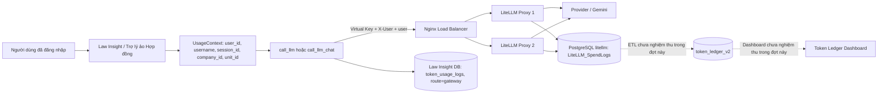
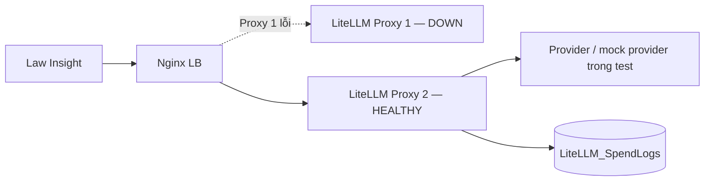
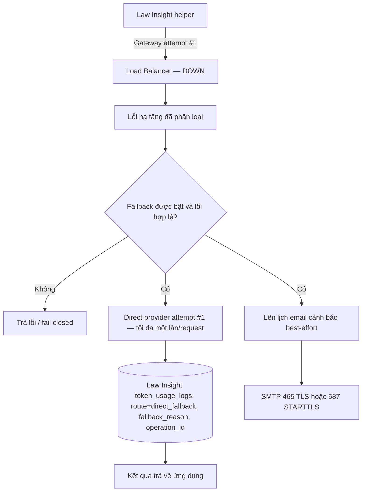
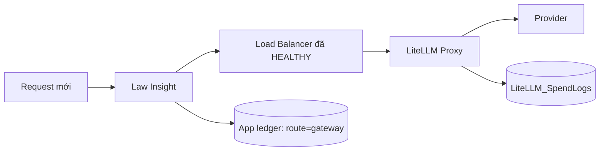

# Báo cáo kết quả kiểm thử Trợ lý ảo Hợp đồng qua API Gateway

- **Ngày lập báo cáo:** 12/09/2026
- **Ứng dụng:** Law Insight — Trợ lý ảo Hợp đồng
- **Repo báo cáo/API Gateway:** `token-ledger-dashboard`, nhánh `ChiThanh`
- **App đã kiểm thử:** `law_insight`, nhánh `api-gateway`, commit `b8e53c9`
- **LiteLLM fork dùng cho môi trường mock:** `litellm_rang_dong`, commit `5b13b8361e`

## 1. Kết luận

Các **core helper** của Trợ lý ảo Hợp đồng đã vượt qua kiểm thử tích hợp trên môi trường mock cô lập:

- App gọi đúng endpoint Load Balancer, không gọi thẳng một Proxy.
- Username từ `UsageContext` được gửi theo từng request qua `X-User` và trường OpenAI `user`.
- Virtual Key sai bị từ chối; thiếu identity bị chặn trước network.
- Khi một LiteLLM Proxy dừng, request vẫn thành công qua Proxy còn lại trong bài test.
- Khi Load Balancer dừng và fallback được bật, app thực hiện tối đa một direct-provider attempt cho mỗi helper request.
- Khi Load Balancer phục hồi, request mới quay lại tuyến Gateway.
- Email cảnh báo được kiểm tra tại SMTP mock, có cooldown chống gửi lặp trong cùng process.
- Gateway SpendLogs khớp response ID, username và token đối với toàn bộ 93 request thành công của bài hồi quy.

**Kết luận phạm vi:** PASS đối với core helper, routing, identity, mock fault injection và SpendLogs. Đây **không phải** chứng nhận production hoặc full end-to-end của toàn bộ pipeline hợp đồng.

## 2. Luồng hoạt động

### 2.1 Luồng bình thường



Trình tự:

1. Backend lấy username từ context xác thực; không tin `X-User` do frontend tự cung cấp.
2. Helper tạo request riêng, gắn Virtual Key của ứng dụng, `X-User=<username>` và `user=<username>`.
3. Nginx LB chuyển request tới một trong hai LiteLLM Proxy.
4. Proxy xác thực Virtual Key, định tuyến model tới provider và ghi `LiteLLM_SpendLogs`.
5. App ghi usage nội bộ với `route=gateway` và `operation_id` để đối soát.

### 2.2 Một Proxy dừng



Trong bài kiểm thử, dừng Proxy thứ hai rồi gửi 8 request với concurrency 2: **8/8 request thành công** qua Gateway. p95 khoảng **2.019 ms**, phản ánh thời gian timeout/failover của topology mock, không phải SLA production.

### 2.3 Load Balancer dừng và direct fallback được bật



Quy tắc:

- Chỉ fallback với lỗi kết nối/timeout hoặc HTTP 502/503/504 đã cấu hình.
- Không fallback khi thiếu identity, sai Virtual Key, lỗi 400/401/403/404/429, lỗi model/config hoặc lỗi chứng chỉ.
- Mỗi helper invocation có tối đa một Gateway attempt và một direct fallback attempt.
- Cooldown email không làm mất quyền fallback của request mới.
- Direct fallback không đi qua Gateway nên không tạo Gateway SpendLog; app phải hạch toán riêng bằng `route=direct_fallback`.
- Fallback và email đều mặc định **tắt**, chỉ hoạt động khi deployment bật rõ ràng.

### 2.4 Load Balancer phục hồi



App không khóa toàn hệ thống vào direct mode sau outage. Mỗi request mới thử Gateway trước; bài test recovery đạt **4/4 request**.

## 3. Dữ liệu được lưu ở đâu

| Tuyến | Nơi lưu | Nội dung đã kiểm tra/thiết kế |
|---|---|---|
| `gateway` | PostgreSQL database `litellm`, bảng `LiteLLM_SpendLogs` | Response/request ID, `end_user`, model, token, tag, trạng thái và metadata Gateway. Bài test chỉ xác minh chuỗi canary không xuất hiện trong các trường log được kiểm tra; không khẳng định mọi trường production đều không chứa nội dung. |
| `gateway` | Database của Law Insight, bảng `token_usage_logs` | Usage và snapshot identity, `route=gateway`, `operation_id`. Persistence PostgreSQL thật chưa được kiểm tra trong harness này. |
| `direct_fallback` | Database của Law Insight, bảng `token_usage_logs` | `route=direct_fallback`, `fallback_reason`, `operation_id`, identity và token. Không có LiteLLM SpendLog vì request bypass Gateway. |
| Tổng hợp dashboard | Database `token_ledger_v2` | Dự kiến nhận dữ liệu từ SpendLogs qua ETL rồi phục vụ dashboard. ETL, mapping user/phòng ban và dashboard chưa được nghiệm thu trong đợt kiểm thử này. |

## 4. Môi trường kiểm thử

```text
Law Insight core helpers
  → http://127.0.0.1:4101/v1
  → Nginx LB mock
  → LiteLLM Proxy mock 1 / Proxy mock 2
  → mock provider
  → PostgreSQL litellm_smoke / LiteLLM_SpendLogs
```

- Network backend là Docker network internal.
- LB chỉ publish ở loopback `127.0.0.1:4101`.
- PostgreSQL mock dùng volume/database riêng, không publish ra host/LAN.
- Không gọi Google/Gemini thật, không gửi Gmail thật và không dùng hợp đồng thật.
- Direct provider và SMTP được thay bằng mock boundary có kiểm soát.
- Harness không ghi vào database ứng dụng Law Insight.

## 5. Kết quả kiểm thử

### 5.1 Bộ test tập trung của ứng dụng

| Hạng mục | Kết quả |
|---|---:|
| Cấu hình fallback mặc định an toàn | PASS |
| Phân loại lỗi Gateway | PASS |
| Routing và giới hạn direct fallback | PASS |
| Identity / `X-User` | PASS |
| Route accounting và operation ID | PASS |
| Migration additive | PASS trên SQLite cô lập |
| SMTP 465 và STARTTLS 587 | PASS với mock |
| Tổng cộng | **140 passed, 19 warnings** |

Đây là 8 module test tập trung, không phải toàn bộ backend suite.

### 5.2 Fault injection cho fallback

Artifact: [`law-fallback-e3cee80a23d0.json`](../artifacts/current/law-fallback-e3cee80a23d0.json)

| Chỉ số | Kết quả |
|---|---:|
| Stages | **20/20 PASS** |
| Gateway SDK attempts | 18 |
| Direct-fallback mock attempts | 9 |
| Usage rows dựng bằng ledger builder | 12: 5 `gateway`, 7 `direct_fallback` |
| SMTP mock email | 1 |
| Key test cleanup | DELETE 200, đọc lại 404 |
| Health sau test | LB, hai Proxy và DB đều healthy |

Hai direct attempts cố ý thất bại không tạo usage row thành công. Số 12 là object được dựng bằng ledger builder trong bộ nhớ, **không phải** 12 bản ghi đã persist vào PostgreSQL của Law Insight.

### 5.3 Hồi quy Load Balancer và SpendLogs

Artifact: [`law-lb-815c700c6af2.json`](../artifacts/current/law-lb-815c700c6af2.json)

| Chỉ số | Kết quả |
|---|---:|
| Request thành công | **93/93** |
| User synthetic | 8 |
| SpendLogs đối soát | **93/93** |
| Response ID duy nhất | 93 |
| Upstream Proxy có traffic | 2/2 |
| Proxy-down | **8/8 thành công** |
| Recovery | **4/4 thành công** |
| Sai Virtual Key | HTTP 401, một SDK attempt, không bypass |
| Thiếu identity | Chặn trước network ở cả hai helper |
| LB-down khi fallback tắt | Một SDK attempt, không bypass |
| Key test cleanup | DELETE 200, đọc lại 404 |

Đối soát đạt với response ID, username, prompt/completion/total token và tag test. Không phát hiện canary trong các trường SpendLogs được kiểm tra.

## 6. Phạm vi chưa được nghiệm thu

- Provider Google/Gemini thật và Gmail thật.
- Toàn bộ authenticated HTTP/UI E2E của Trợ lý ảo Hợp đồng.
- Pipeline upload/phân tích hợp đồng thật, OCR, Marker và LlamaParse.
- Persistence vào PostgreSQL thật của Law Insight và migration trên staging/production.
- ETL `LiteLLM_SpendLogs → token_ledger_v2`, mapping user/phòng ban và giao diện dashboard.
- Redis/Sentinel, topology production, soak/open-loop load và capacity/SLA.
- Dedup email giữa nhiều worker; cooldown hiện chỉ trong từng process, không có durable queue/recovery alert.
- Exactly-once provider execution: timeout sau khi upstream đã nhận request vẫn có nguy cơ phát sinh chi phí trùng.

## 7. Bằng chứng liên quan

- [Báo cáo fallback và retest](./FALLBACK-RETEST-REPORT.md)
- [Báo cáo LB ban đầu](./LB-TEST-REPORT.md)
- [Audit identity và các đường LLM](./identity-audit.md)
- [Sơ đồ HTML Gateway/fallback](./gateway-architecture-diagram.html)
- [Artifact fallback PASS](../artifacts/current/law-fallback-e3cee80a23d0.json)
- [Artifact LB PASS](../artifacts/current/law-lb-815c700c6af2.json)

## 8. Kết luận bàn giao

Trợ lý ảo Hợp đồng đã có bằng chứng PASS cho core helper qua API Gateway mock, `X-User`, hai Proxy, SpendLogs, Proxy failover, LB outage/direct fallback, cảnh báo SMTP mock và recovery. Trước khi triển khai thực tế vẫn cần nghiệm thu các phần ở mục 6, cấu hình endpoint HTTPS/model/Virtual Key production và giữ fallback/email mặc định tắt cho tới khi deployment được phê duyệt.
