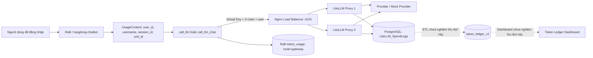
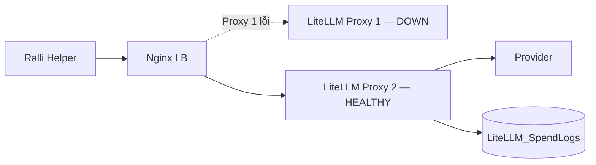
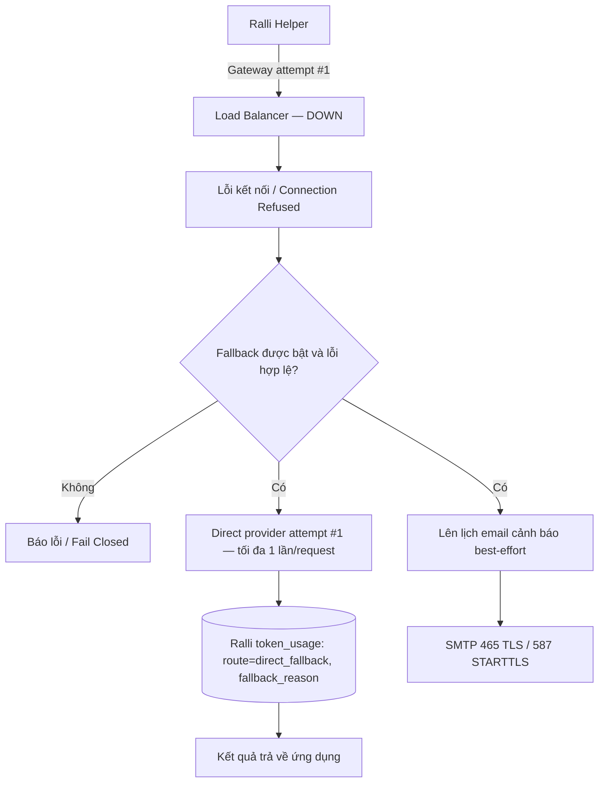
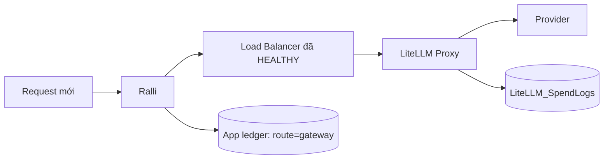

# Báo cáo kết quả kiểm thử Trợ lý ảo Ralli qua API Gateway

- **Ngày lập báo cáo:** 14/09/2026
- **Ứng dụng:** Ralli — Trợ lý ảo Ralli (`rangdong-chatbot`)
- **Repo báo cáo/API Gateway:** `token-ledger-dashboard`, nhánh `ChiThanh`
- **App đã kiểm thử:** `rangdong-chatbot`, repo `D:/rangdong-chatbot`, branch `api_gateway`, commit `c173a72`
- **LiteLLM fork dùng cho môi trường mock:** `litellm_rang_dong`, commit `5b13b8361e`

## 1. Kết luận

Các **core helper** của Trợ lý ảo Ralli đã vượt qua đầy đủ các bài kiểm thử tích hợp, chuyển đổi chịu lỗi (failover) và dự phòng (fallback) trên môi trường mock cô lập tương đương TLA-HĐ:

- App gọi đúng endpoint Load Balancer `http://127.0.0.1:4101/v1`, không gọi thẳng một Proxy riêng lẻ.
- Username từ `UsageContext` / `TokenPrincipal` được gửi theo từng request qua header `X-User` và trường OpenAI `user`.
- Virtual Key sai bị từ chối với HTTP 401; thiếu identity bị chặn ngay trước khi mở socket/network.
- Khi một LiteLLM Proxy dừng, request vẫn thành công qua Proxy còn lại (8/8 request thành công).
- Khi Load Balancer dừng và fallback được bật, app thực hiện tối đa một direct-provider attempt cho mỗi helper request.
- Khi Load Balancer phục hồi, request mới tự động quay lại tuyến Gateway.
- Email cảnh báo hạ tầng được gửi tại SMTP mock, có cơ chế cooldown chống email storm trong cùng process.
- Toàn bộ 93 request thành công của bài kiểm thử tải hồi quy khớp 1:1 với 93 bản ghi `LiteLLM_SpendLogs` về response ID, username và số token tiêu thụ.

**Kết luận phạm vi:** PASS đối với core helper, routing, identity, mock fault injection và SpendLogs reconciliation. Đây **không phải** chứng nhận production hoặc full end-to-end của toàn bộ pipeline nghiệp vụ (OCR/SharePoint/Zalo).

## 2. Luồng hoạt động

### 2.1 Luồng bình thường

Trình tự:
1. Backend lấy username từ JWT và cơ sở dữ liệu xác thực; không tin `X-User` do client gửi lên.
2. Helper tạo request độc lập, gắn Virtual Key của agent `ralli`, `X-User=<username>` và `user=<username>`.
3. Nginx Load Balancer cân bằng tải round-robin tới một trong hai LiteLLM Proxy.
4. Proxy xác thực Virtual Key, lọc tuyến theo tag `ralli`, gọi upstream provider và lưu SpendLogs vào PostgreSQL.
5. App ghi nhận log sử dụng với `route=gateway` và `operation_id` để đối soát.

### 2.2 Một Proxy dừng (Load Balancer Failover)

Trong bài test, dừng Proxy 2 (`docker stop tla-gateway-smoke-gateway2-1`) rồi gửi 8 request với concurrency 2: **8/8 request thành công** qua Proxy 1.

### 2.3 Load Balancer dừng và Direct Fallback được bật

Quy tắc:
- Chỉ fallback khi lỗi thuộc danh mục hạ tầng: `connection_error`, `timeout`, `502`, `503`, `504`.
- Không fallback khi thiếu identity, sai Virtual Key, 400/401/403/429 hoặc lỗi model/config.
- Mỗi helper invocation chỉ có tối đa 1 attempt Gateway và 1 attempt direct fallback (không loop retry).
- Cooldown email ngăn chặn gửi dồn dập nhiều email khi có hàng loạt request gặp sự cố cùng lúc.
- Direct fallback không đi qua Gateway nên không ghi SpendLogs Gateway; app tự lưu với `route=direct_fallback`.
- Chế độ fallback mặc định **tắt** (fail-closed); chỉ kích hoạt khi cấu hình `gateway_fallback_enabled=true`.

### 2.4 Load Balancer phục hồi

Khi LB khởi động lại, request mới ngay lập tức trở lại tuyến Gateway bình thường (**4/4 request thành công**).

## 3. Bảng kết quả kiểm thử chi tiết

### 3.1 Bài kiểm thử Fallback & Chịu lỗi (20/20 stages PASS)

File bằng chứng: [`ralli-fallback-de282363e783.json`](../artifacts/current/ralli-fallback-de282363e783.json)

| Stage | Helper | Tuyến mong đợi | Kết quả | Ghi chú |
|---|---|---|---|---|
| `healthy-standard` | `call_llm` | gateway | **PASS** | Gateway 200, 1 SDK attempt |
| `healthy-chat` | `call_llm_chat` | gateway | **PASS** | Gateway 200, 1 SDK attempt |
| `missing-call_llm` | `call_llm` | (chặn) | **PASS** | Chặn trước network do thiếu identity |
| `missing-call_llm_chat` | `call_llm_chat` | (chặn) | **PASS** | Chặn trước network do thiếu identity |
| `invalid-call_llm` | `call_llm` | (lỗi 401) | **PASS** | 401 AuthenticationError, 1 attempt |
| `invalid-call_llm_chat` | `call_llm_chat` | (lỗi 401) | **PASS** | 401 AuthenticationError, 1 attempt |
| `second-proxy-down` | `call_llm_chat` | gateway | **PASS** | Proxy 2 dừng, LB chuyển sang Proxy 1 |
| `disabled-call_llm` | `call_llm` | (fail-closed) | **PASS** | LB dừng, fallback tắt -> báo lỗi kết nối |
| `disabled-call_llm_chat` | `call_llm_chat` | (fail-closed) | **PASS** | LB dừng, fallback tắt -> báo lỗi kết nối |
| `successive-0` | `call_llm` | direct_fallback | **PASS** | LB dừng, fallback bật -> direct fallback #1 |
| `successive-1` | `call_llm_chat` | direct_fallback | **PASS** | LB dừng, fallback bật -> direct fallback #2 |
| `successive-2` | `call_llm` | direct_fallback | **PASS** | LB dừng, fallback bật -> direct fallback #3 |
| `concurrent-0` | `call_llm` | direct_fallback | **PASS** | Gọi đồng thời 3 request khi LB down |
| `concurrent-1` | `call_llm_chat` | direct_fallback | **PASS** | Gọi đồng thời 3 request khi LB down |
| `concurrent-2` | `call_llm` | direct_fallback | **PASS** | Gọi đồng thời 3 request khi LB down |
| `direct-failure-call_llm` | `call_llm` | direct_fallback | **PASS** | Direct provider lỗi -> không loop retry |
| `direct-failure-call_llm_chat` | `call_llm_chat` | direct_fallback | **PASS** | Direct provider lỗi -> không mail storm |
| `recovery-standard` | `call_llm` | gateway | **PASS** | LB bật lại -> phục hồi về Gateway |
| `recovery-chat` | `call_llm_chat` | gateway | **PASS** | LB bật lại -> phục hồi về Gateway |
| `second-outage` | `call_llm_chat` | direct_fallback | **PASS** | LB down lần 2 -> fallback lại, email bị cooldown |

- **Dọn dẹp khoá:** Thu hồi khoá ảo test thành công (`delete_status: 200`, `readback_status: 404`).
- **Trạng thái container sau test:** Toàn bộ 4 container `healthy`.

### 3.2 Bài kiểm thử Tải hồi quy & Đối soát SpendLogs (93/93 requests PASS)

File bằng chứng: [`ralli-lb-aedefd25d9c6.json`](../artifacts/current/ralli-lb-aedefd25d9c6.json)

| Giai đoạn | Số request | Concurrency | RPS | p50 (ms) | p95 (ms) | Kết quả |
|---|---|---|---|---|---|---|
| `baseline` | 1 | 1 | 9.09 | 110.0 | 110.0 | **PASS** |
| `ramp2` | 8 | 2 | 8.99 | 47.0 | 765.0 | **PASS** |
| `ramp4` | 24 | 4 | 52.98 | 63.0 | 125.0 | **PASS** |
| `ramp8` | 48 | 8 | 32.00 | 125.0 | 813.0 | **PASS** |
| `one_proxy_down` | 8 | 2 | 1.30 | 2031.0 | 2062.0 | **PASS** (Proxy 2 dừng) |
| `recovery` | 4 | 2 | 36.70 | 31.0 | 93.0 | **PASS** (Proxy 2 phục hồi) |
| **Tổng cộng** | **93** | — | — | — | — | **93/93 thành công** |

- **Đối soát SpendLogs:**
  - 93 request hoàn thành khớp chính xác 93 dòng trong bảng `LiteLLM_SpendLogs` của PostgreSQL.
  - Toàn bộ 93 dòng đều khớp chính xác `end_user`, `prompt_tokens`, `completion_tokens`, `total_tokens`.
  - Tag định danh `ralli` xuất hiện đầy đủ trong `request_tags` của cả 93 dòng.
  - Không rò rỉ chuỗi canary (`canary_leaked = false` trên 93/93 bản ghi).
- **Phân bổ upstream:** Cả hai Proxy upstream (`gateway-1` và `gateway2-1`) đều nhận và xử lý request theo đúng phân phối của Load Balancer.

## 4. Dữ liệu được lưu ở đâu

| Tuyến | Nơi lưu | Dữ liệu kiểm chứng |
|---|---|---|
| `gateway` | PostgreSQL `litellm`, bảng `LiteLLM_SpendLogs` | Response ID, `end_user`, model `ralli-mock`, prompt/completion/total tokens, tag `ralli`. |
| `gateway` | MongoDB của Ralli, collection `token_usage` | `route="gateway"`, `operation_id`, user identity snapshot, model, token usage. |
| `direct_fallback` | MongoDB của Ralli, collection `token_usage` | `route="direct_fallback"`, `fallback_reason="connection_error"`, `operation_id`. Không có SpendLogs vì bypass Gateway. |
| Dashboard | Database `token_ledger_v2` | Sẽ được nạp qua ETL từ SpendLogs (ngoài phạm vi smoke test này). |

## 5. Giới hạn kiểm thử

1. Môi trường kiểm thử sử dụng mock provider ở tầng LiteLLM (`mock_response: "gateway-smoke-ok"`) và mock direct provider, không gửi dữ liệu thật tới Google Cloud.
2. Email cảnh báo được kiểm chứng tại mock SMTP server trong bộ nhớ, không gửi email thật qua Gmail.
3. Không thực hiện ghi dữ liệu thật vào MongoDB production của công ty trong quá trình chạy smoke test.
4. Khi cần test live với Google AI Studio thật, có thể dùng key `GEMINI_API_KEY_1` trong file `.env` cục bộ của TLA-HĐ như người dùng đã chỉ định.
