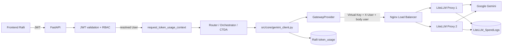
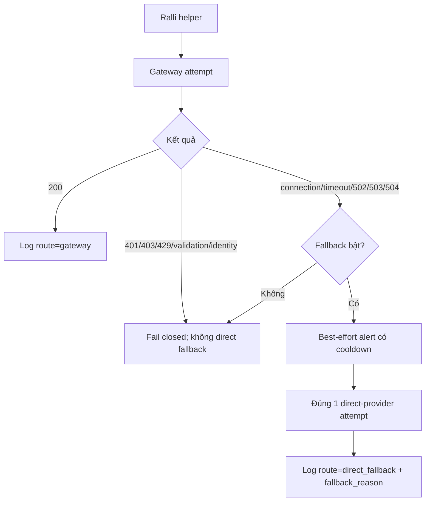

# Báo cáo kỹ thuật chi tiết: tích hợp Ralli AI qua API Gateway

## 1. Thông tin tài liệu

| Thuộc tính | Giá trị |
|---|---|
| Ứng dụng | Ralli AI (`rangdong-chatbot`) |
| Repo ứng dụng | `D:/rangdong-chatbot` |
| Nhánh ứng dụng | `api_gateway` |
| Commit ứng dụng | `c173a725c16fc755ada3ed44efcca21025b52a8f` |
| Repo API Gateway/báo cáo | `D:/token-ledger-dashboard` |
| Nhánh API Gateway | `ChiThanh` |
| Agent code | `ralli` |
| Project/catalog | `tla-ralli`; catalog đã có `agent_id: 8` |
| Ngày kiểm thử | 14/09/2026 |
| Mục tiêu | Định tuyến request Ralli qua Load Balancer và hai LiteLLM Proxy, gắn đúng người dùng, ghi usage, kiểm tra failover/fallback và không làm lẫn danh tính giữa request |

## 2. Kết luận điều hành

Kết quả hiện tại là **PASS có điều kiện** đối với các phần sau:

1. Gateway provider và failure policy ở cấp helper.
2. Request scope lấy danh tính từ JWT/RBAC backend và bao quanh luồng xử lý của các router đã sửa.
3. Cách ly danh tính giữa hai người dùng chạy đồng thời.
4. Định tuyến helper qua Nginx Load Balancer tới hai LiteLLM Proxy trong môi trường mock cô lập.
5. Failover khi một Proxy dừng; fail-closed khi Load Balancer dừng và fallback tắt; direct fallback có giới hạn khi được bật; quay lại Gateway sau phục hồi.
6. Đối soát 93 response mock với 93 `LiteLLM_SpendLogs` theo response ID, username và token.
7. Smoke thật qua Google: 6/6 lượt sinh nội dung thành công, gồm 5 lượt qua Gateway và 1 direct fallback; 5 lượt Gateway khớp SpendLogs.

Kết quả **chưa đủ để tuyên bố production-ready hoặc full end-to-end**. Chưa nghiệm thu giao diện Ralli → endpoint thật → toàn bộ nghiệp vụ → Gateway thật trong một lượt duy nhất; chưa kiểm tra ghi MongoDB application thật, ETL sang `token_ledger_v2`, dashboard, SMTP thật, tất cả đường OCR/summarizer/Excel, hoặc tải production. Hai test snapshot toàn repo vẫn thiếu một artifact dữ liệu ngoài source tree.

## 3. Vấn đề của code cũ

### 3.1 Danh tính chưa có vòng đời request

Router cũ gọi `set_current_user(...)` trước khi gọi nghiệp vụ. Setter có thể đặt `TokenPrincipal` trong `ContextVar`, nhưng **không tạo active `ModelCallContext`** và không đảm bảo reset bằng token khi request kết thúc.

Trong Gateway mode, `GatewayProvider` yêu cầu call context đang active. Luồng router cũ vì vậy bị chặn ngay trong Ralli với lỗi danh tính đáng tin cậy chưa tồn tại, trước khi mở kết nối tới Load Balancer.

Nếu bỏ chốt này hoặc bật `scope_active=True` vĩnh viễn trong setter, hệ thống có thể gửi request thiếu nguồn xác thực hoặc giữ nhầm identity giữa các công việc bất đồng bộ. Vì vậy giải pháp đúng là scope có lifecycle, không phải thêm header từ frontend.

### 3.2 Helper Gemini đi trực tiếp provider

`src/core/gemini_client.py` trước đó sử dụng Google SDK trực tiếp. Không có transport OpenAI-compatible dùng Virtual Key để gọi LiteLLM, không có route audit rõ `gateway`/`direct_fallback`, và không có policy phân loại lỗi để quyết định lỗi nào được fallback.

### 3.3 Accounting thiếu trường đối soát Gateway

Schema usage cũ chủ yếu ghi model và token. Nó thiếu route, fallback reason, operation ID, provider response ID và agent code cần thiết để nối request ứng dụng với SpendLogs.

### 3.4 Router và background/admin path không cùng contract

Các đường assistant, CTDA và tác vụ admin NLP gọi sâu vào helper nhưng không có một contract chung về principal/correlation scope. Điều này khiến helper tự đặt danh tính hoặc dùng `system` một cách không kiểm soát.

## 4. Thiết kế mới

### 4.1 Luồng request bình thường



Identity frontend cung cấp trong `X-User` hoặc body không được tin. Backend dùng `current_user` do dependency xác thực/phân quyền trả về. Scope bao trọn lời gọi nghiệp vụ và được reset trong `finally`.

### 4.2 Hợp đồng identity và correlation

| Dữ liệu | Nguồn | Đích sử dụng |
|---|---|---|
| `user_id` | User record sau JWT lookup | Principal nội bộ và application usage |
| `username` | User record sau JWT lookup | `X-User`, OpenAI body `user`, SpendLogs `end_user` |
| `company_id` | User record | Usage snapshot phía ứng dụng |
| `unit_id` | User record | Principal/usage snapshot |
| `department` | User record | Principal để mapping tổ chức; không trộn với company/unit |
| `conversation_id` | Request hoặc fallback username hiện hữu | Correlation theo hội thoại |
| `operation_id` | UUID mới cho mỗi scope | Nối các model calls thuộc cùng operation |
| `agent_code` | Cấu hình cố định `ralli` | Agent attribution/tag/mapping |
| Virtual Key | Secret cấu hình ứng dụng | Xác thực app Ralli với Gateway; không đại diện người dùng |

### 4.3 Luồng lỗi



Fallback mặc định tắt. Một Proxy down do Load Balancer xử lý; Load Balancer down là ranh giới app-to-Gateway nên chỉ application mới có thể chọn direct fallback.

## 5. Thay đổi code chi tiết

Commit ứng dụng `c173a72` gồm **23 file, 3.420 dòng thêm và 192 dòng xóa**.

| File/nhóm | Code cũ | Code mới và lý do |
|---|---|---|
| `main.py` | `/ask` gọi `set_current_user` rồi xử lý | Bọc toàn bộ handler bằng `request_token_usage_context`; tách `_process_query_scoped` để scope bao trọn classifier và assistant dispatch mà không đổi nghiệp vụ |
| `src/routers/assistant.py` | `_set_token_user` đặt principal nhưng không active scope và nuốt lỗi | Bỏ helper đó; bọc `/ask`, `/ask-file`, CNNV reindex bằng user do guard trả về |
| `src/routers/ctda.py` | analyze/admin NLP/refresh chưa có Gateway scope | Bọc analyze v1/v2, NLP tagging và refresh-data; giữ quyền, tham số và thứ tự xử lý |
| `src/core/token_principal.py` | Principal ContextVar cơ bản | Thêm `ModelCallContext`, operation/conversation metadata, `scope_active`, context manager reset đúng token trong `finally` |
| `src/core/token_logger.py` | Không có module scope/accounting thống nhất | Thêm `UsageContext`, `request_token_usage_context`, normalize provider usage và row builder |
| `src/core/llm_provider.py` | Không có Gateway transport | Thêm provider OpenAI-compatible cho text/JSON/structured/vision, validate URL/config/identity, no transport retry, sanitize lỗi, lifecycle `close` |
| `src/core/gemini_client.py` | Google SDK trực tiếp | Giữ API helper cũ nhưng thêm chọn Gateway/direct, gọi `GatewayProvider`, track usage và direct fallback có điều kiện |
| `src/core/gateway_settings.py` | Không có settings Gateway/fallback/alert | Thêm cấu hình backend, URL, Virtual Key, model, timeout, fallback allowlist và SMTP validation |
| `src/core/llm_errors.py` | Không có classifier Gateway thống nhất | Phân loại typed/sanitized transport error; không fallback 4xx, invalid URL, SSL hoặc validation |
| `src/core/email_alerts.py` | Không có alert outage | Thêm alert best-effort ngoài event loop, giới hạn pending và cooldown theo endpoint |
| `src/core/token_tracker.py` | Usage schema cũ; Mongo timeout mặc định | Thêm `route`, `agent_code`, `fallback_reason`, `operation_id`, `provider_response_id`; timeout Mongo có cấu hình |
| `src/core/llm.py` | Không có helper/policy smoke dùng chung | Thêm helper phục vụ fault-policy smoke; không dùng kết quả của nó để thay thế test helper sản phẩm |
| `tests/` | Chưa có scope/Gateway/authenticated-route regression | Thêm provider, errors, principal, nested/error/cancellation/concurrency, router và ASGI JWT/RBAC tests; runner offline chặn dotenv và external egress |

### 5.1 Router đã được bọc scope

| Route/công việc | `function_name` | Session/conversation |
|---|---|---|
| Legacy `/ask` | `legacy_ask` | request conversation hoặc username |
| Assistant `/api/assistant/ask` | `assistant_ask` | conversation hoặc username |
| Assistant `/api/assistant/ask-file` | `assistant_ask_file` | conversation hoặc username |
| CNNV reindex | `assistant_cnnv_reindex` | Không có |
| CTDA analyze v1 | `ctda_analyze_v1` | Không có |
| CTDA analyze v2 | `ctda_analyze_v2` | conversation từ request |
| CTDA NLP tags | `ctda_run_nlp_tags` | Không có |
| CTDA refresh data | `ctda_refresh_data` | Không có; hai stage dùng chung operation scope |

## 6. Phương pháp kiểm thử và ranh giới bằng chứng

Báo cáo phân biệt bốn tầng, không cộng gộp chúng thành một tuyên bố E2E:

| Tầng | Bắt đầu từ đâu | Provider | Chứng minh được | Không chứng minh được |
|---|---|---|---|---|
| Unit/scope | Context manager/provider function | Mock/loopback | Validation, identity guard, reset, concurrency, error policy | FastAPI/JWT hoặc Gateway thật |
| Authenticated ASGI | JWT → RBAC → `/api/assistant/ask` | `GatewayProvider` với HTTP MockTransport | Backend-derived identity đi đến HTTP boundary | LB/LiteLLM/Google thật và toàn business logic |
| Gateway mock | Ralli core helper → LB → hai LiteLLM mock | LiteLLM mock response | LB routing, Proxy failover, Virtual Key, SpendLogs, token reconciliation | Google model availability/cost và endpoint JWT |
| Provider-real | `gemini_generate_text` với synthetic principal | Google thật qua Gateway và direct fallback | Helper/transport/LB/Proxy/Google/fallback thật | JWT endpoint, UI, Mongo/ETL/dashboard |

## 7. Kết quả unit, scope và authenticated HTTP

### 7.1 Bộ test tập trung

Lệnh:

```bash
.venv-gateway-test/Scripts/python.exe tests/run_scope_tests_offline.py -q \
  tests/test_request_token_context.py \
  tests/test_legacy_request_scope.py \
  tests/test_gateway_authenticated_routes.py \
  tests/test_router_token_scopes.py \
  tests/test_llm_errors.py \
  tests/test_llm_gateway_provider.py \
  tests/test_token_usage_principal.py \
  tests/test_assistant_*.py \
  tests/test_ctda_*.py
```

Kết quả: **607 passed, 1 warning trong 19,30 giây**. Warning là Pydantic class-based Config deprecation đã tồn tại.

Đã kiểm tra:

- Nested scope khôi phục principal/call/usage context bên ngoài.
- Reset sau success, exception và task cancellation.
- Hai request bất đồng bộ không lẫn user hoặc operation ID.
- Context truyền qua `asyncio.to_thread`.
- Metadata company/unit/department tách riêng.
- Upload validation không mở scope/gọi orchestrator sai thời điểm.
- Response contract và router dispatch cũ được giữ.

### 7.2 Authenticated ASGI test

Test chạy FastAPI ASGI với logic JWT và RBAC thật; chỉ mock user storage, permission storage và model transport.

Kết quả **PASS** cho:

- JWT hợp lệ được lookup thành user backend.
- RBAC yêu cầu chính xác quyền `chat:ask`.
- Hai user song song giữ đúng `user_id`, `username`, company, unit và department.
- `X-User` và body `user` tại Gateway transport cùng bằng username backend.
- `X-User` giả và username giả do client gửi không thay được identity.
- JWT hết hạn, malformed JWT, thiếu auth và role bị từ chối không tạo thêm model call.

Đây là **authenticated HTTP integration offline**, không phải full UI hoặc live Gateway E2E.

### 7.3 Full offline suite

Lệnh:

```bash
.venv-gateway-test/Scripts/python.exe tests/run_scope_tests_offline.py -q tests
```

Kết quả: **827 passed, 2 failed, 17 warnings trong 57,49 giây**.

Hai lỗi không nằm trong phần Gateway. Cả hai yêu cầu file ngoài source tree đang thiếu:

```text
outputs/ctda-standard-prod-final-20260607-portable-folder/
  STD-005-so-luong-cong-trinh-dien-ap-mai-thang-5-2026/
  observation.json
```

Các test lỗi:

1. `test_manifest_keeps_real_links_snapshot_ids_and_verified_numbers`
2. `test_figures_are_generated_from_the_manifest`

Không tạo dữ liệu giả, không skip và không sửa yếu assertion. Vì vậy toàn suite phải báo **827 pass / 2 fail**, không báo “all tests pass”.

## 8. Gateway mock: fault, fallback và recovery

Artifact: [`ralli-fallback-de282363e783.json`](../artifacts/current/ralli-fallback-de282363e783.json)

Phạm vi: core helper thật + SDK thật + Nginx LB thật + hai LiteLLM Proxy dùng mock response; direct provider và SMTP là mock.

Kết quả tổng:

| Chỉ số | Kết quả |
|---|---:|
| Stages | **20/20 PASS** |
| Gateway SDK attempts | 18 |
| Direct fallback attempts | 9 |
| Usage rows dựng bởi application logger | 12 |
| Mock alert emails | 1 |
| Cleanup errors | 0 |
| Virtual Key cleanup | DELETE 200; readback 404 |
| Trạng thái cuối | LB, hai Proxy và DB đều healthy |

### 8.1 Ma trận 20 stage

| Nhóm | Stage | Kỳ vọng | Kết quả |
|---|---|---|---|
| Healthy | `healthy-standard`, `healthy-chat` | Gateway, một attempt | PASS |
| Missing identity | `missing-call_llm`, `missing-call_llm_chat` | Chặn trước network | PASS |
| Invalid key | `invalid-call_llm`, `invalid-call_llm_chat` | AuthenticationError; không fallback | PASS |
| Proxy failure | `second-proxy-down` | LB chuyển sang Proxy còn sống | PASS |
| LB down/fallback off | `disabled-call_llm`, `disabled-call_llm_chat` | ConnectError, fail-closed | PASS |
| LB down/fallback on | `successive-0..2` | Mỗi request: một Gateway + một direct | PASS |
| Concurrent outage | `concurrent-0..2` | Ba request độc lập đều có budget fallback riêng | PASS |
| Direct fallback failure | Hai stage `direct-failure-*` | Không loop retry, không mail storm | PASS |
| Recovery | `recovery-standard`, `recovery-chat` | Request mới quay lại Gateway | PASS |
| Outage lần hai | `second-outage` | Fallback lại; alert vẫn chịu cooldown | PASS |

Egress guard chỉ cho application gọi `http://127.0.0.1:4101`; dotenv bị chặn. Direct và SMTP boundary được mock rõ ràng.

## 9. Gateway mock: tải hồi quy và SpendLogs

Artifact: [`ralli-lb-aedefd25d9c6.json`](../artifacts/current/ralli-lb-aedefd25d9c6.json)

Phạm vi: Ralli helper thật → Nginx LB → hai LiteLLM mock Proxy → PostgreSQL SpendLogs cô lập.

### 9.1 Kết quả theo stage — số liệu lấy trực tiếp từ artifact cuối

| Stage | Requests | Concurrency | RPS | p50 ms | p95 ms | p99 ms |
|---|---:|---:|---:|---:|---:|---:|
| baseline | 1 | 1 | 10,64 | 94 | 94 | 94 |
| ramp2 | 8 | 2 | 57,14 | 31 | 47 | 47 |
| ramp4 | 24 | 4 | 24,77 | 62 | 703 | 704 |
| ramp8 | 48 | 8 | 62,66 | 110 | 156 | 156 |
| one_proxy_down | 8 | 2 | 1,92 | 47 | 2.047 | 2.047 |
| recovery | 4 | 2 | 51,28 | 31 | 47 | 47 |
| **Tổng** | **93** | — | — | — | — | — |

Latency/RPS chỉ là mock closed-loop trên máy test, **không phải capacity production**. Stage một Proxy down có tail latency khoảng hai giây do thời gian phát hiện/chuyển upstream.

### 9.2 Đối soát

| Kiểm tra | Kết quả |
|---|---|
| Helper responses | 93 |
| SpendLogs | 93 |
| Join response ID ↔ request ID | 93/93 |
| Username ↔ `end_user` | 93/93 |
| Prompt/completion/total token | 93/93 |
| Tổng token | 2.790 ở application calls và SpendLogs |
| Agent tag | `ralli` trong 93/93 SpendLogs |
| User synthetic | 8 user; mỗi user 11 hoặc 12 request |
| Canary scan | Không thấy canary trong các trường được harness kiểm tra, 93/93 |
| Upstream | Cả hai Proxy đều xuất hiện trong LB trace |
| Virtual Key cleanup | DELETE 200; readback 404 |

Negative probes cũng PASS: thiếu identity bị chặn trước network; key sai trả 401 với một attempt và không bypass; LB outage với fallback tắt có một attempt và không bypass.

## 10. Provider-real: Google Gemini

### 10.1 Qua LB và hai Proxy, có failover/fallback/recovery

Artifact: [`ralli-google-de652caba3.json`](../artifacts/current/ralli-google-de652caba3.json)

Phạm vi: helper sản phẩm `gemini_generate_text()` → Nginx tạm → hai LiteLLM Proxy → Google Gemini; synthetic principal được tạo trực tiếp trong harness.

| Stage | Route | Kết quả | Token |
|---|---|---|---:|
| baseline | Gateway | PASS | 15 |
| two users parallel — user 1 | Gateway | PASS | 15 |
| two users parallel — user 2 | Gateway | PASS | 15 |
| one Proxy down | Gateway | PASS | 15 |
| LB down, fallback enabled | Direct Google | PASS | 15 |
| LB recovery | Gateway | PASS | 15 |
| **Tổng** | **5 Gateway + 1 direct** | **6/6 PASS** | **90** |

Đối soát:

- 5 Gateway responses có 5 SpendLogs.
- 5/5 khớp response ID, `end_user`, prompt/completion/total token và tag `ralli`.
- LB trace xác nhận cả hai Proxy đã xử lý request.
- Missing scope bị chặn.
- Virtual Key sai bị chặn và không gửi direct HTTP.
- LB down với fallback tắt bị chặn và không gửi direct HTTP.
- LB down với fallback bật chỉ có **1 direct HTTP send**.
- Sau phục hồi, request mới quay lại Gateway.
- Virtual Key tạm được xóa: DELETE 200, readback 404.
- Stack Google-real tạm đã được dọn; đây không phải deployment còn chạy.

### 10.2 Direct fallback Google thật, một request có giới hạn

Artifact: [`ralli-real-fallback-6f2ce026.json`](../artifacts/current/ralli-real-fallback-6f2ce026.json)

| Thuộc tính | Kết quả |
|---|---|
| Helper | `gemini_generate_text()` thật |
| Điều kiện | LB đã dừng |
| Provider HTTP attempts | 1 |
| Provider status | 200 |
| Route | `direct_fallback` |
| Reason | `connection_error` |
| Token | 17 prompt + 12 completion = 29 |
| Application storage | Row builder thật; insert chặn trong memory |
| LB recovery | Readiness 200 |
| SMTP | Tắt |

Hai provider-real artifact không chứa key; chỉ ghi tên nguồn key. Chúng chứng minh helper/transport/provider, **không chứng minh JWT-to-scope của endpoint**. Phần đó được kiểm tra riêng ở authenticated ASGI test.

## 11. Bảo mật và riêng tư

### 11.1 Đã kiểm tra

- Identity lấy từ backend guard, không từ frontend header/body.
- Missing scope chặn trước network.
- Virtual Key sai không kích hoạt fallback.
- Provider error được sanitize; Authorization và prompt không đi vào exception message được báo cáo.
- `GatewayProvider` dùng client riêng, `trust_env=False`, HTTP retries bằng 0.
- Fallback allowlist không gồm 400/401/403/429, identity, validation, SSL hoặc invalid URL.
- Test offline chặn `.env` và external egress.
- Staged diff được scan pattern credential trước commit trước đó; không commit `.env`.
- Virtual Key tạm được thu hồi và readback 404.

### 11.2 Giới hạn của privacy probe

`canary_leaked=false` chỉ có nghĩa harness không tìm thấy canary trong các SpendLog fields đã chọn. Không được diễn giải thành “Gateway không lưu bất kỳ prompt nào ở mọi bảng/log”. Cấu hình production vẫn phải giữ `turn_off_message_logging: true`, `forward_client_headers_to_llm_api: false`, kiểm soát log Nginx và retention DB.

## 12. Dữ liệu và accounting

| Route | Gateway SpendLogs | Application usage | Trạng thái kiểm chứng |
|---|---|---|---|
| `gateway` mock | Có | Row dựng trong memory | 93/93 SpendLogs đã đối soát; Mongo thật chưa kiểm tra |
| `gateway` Google thật | Có | Row dựng trong memory | 5/5 SpendLogs đã đối soát; Mongo thật chưa kiểm tra |
| `direct_fallback` | Không, vì bypass Gateway | Phải ghi route/reason/operation tại app | Row dựng đúng trong memory; persistence thật chưa kiểm tra |
| ETL | N/A | `token_ledger_v2` dự kiến nhận dữ liệu | Chưa chạy/nghiệm thu trong lượt Ralli |
| Dashboard | N/A | Aggregate theo agent/user/department | Chưa nghiệm thu |

Không cộng application rows dựng trong memory thành “đã ghi MongoDB”. Không suy ra ETL/dashboard từ việc SpendLogs tồn tại.

## 13. Ảnh hưởng tới Gateway dùng chung cho nhiều agent

Thay đổi trong repo Gateway hiện chỉ thêm route **mock** `ralli-mock` ở `tools/gateway-smoke/runtime/config.yaml`, hai harness và tài liệu/artifact. Nó không sửa `docker/gateway/config.gateway.yaml` production, do đó không thay route production của TLA-HĐ, CRM hoặc DMS.

Khi triển khai nhiều agent cần giữ contract:

1. Mỗi agent dùng agent code và Virtual Key riêng.
2. Virtual Key mang đúng một tag định danh agent.
3. Deployment dùng cho tag filtering không mang đồng thời nhiều tag định danh agent.
4. `router_settings.enable_tag_filtering: true` phải bật.
5. `X-User` chỉ chứa claim/user đã được backend xác thực; không chứa JWT.
6. `forward_client_headers_to_llm_api: false` để không chuyển JWT/header nhân viên tới provider.
7. Catalog/ETL mapping phải phân giải duy nhất `ralli` → project `tla-ralli` → agent 8.
8. Thay đổi shared config phải chạy regression các agent hiện hữu, không chỉ Ralli.

**Quan trọng:** `ralli-mock` dùng `mock_response` và `api_base: http://127.0.0.1:9/v1`; tuyệt đối không đưa nguyên route này vào production.

## 14. Rủi ro còn mở trong commit ứng dụng

### P0 — phải sửa trước production

1. `_check_budget()` trong `gemini_client.py` bắt mọi exception và bỏ qua; có thể nuốt `BudgetExceededError` và làm budget fail-open.
2. `check_budget_sync()` trả `True` khi Mongo unreachable; cần quyết định fail-closed hoặc policy có audit rõ, không để mặc định im lặng.
3. `log_usage_sync()` nuốt mọi lỗi insert Mongo; có thể mất accounting mà request vẫn thành công.
4. `_get_direct_key()` còn tìm credential trong `D:/law_insight/.env` hoặc `C:/law_insight/.env`; đây là lookup chéo repository không phù hợp production và cần xóa.

### P1 — phải hoàn thiện để nghiệm thu tích hợp

1. Migrate các direct Gemini SDK bypass còn lại, gồm ít nhất `processing/gemini_query.py` và `src/core/memory_ai_summarizer.py`; rà lại nhánh Vision private client.
2. Background/detached worker phải tự tạo system/user principal trong worker lifetime; không dựa vào outer HTTP scope.
3. Persist đầy đủ operation/conversation/company/unit/department/provider-response metadata vào application ledger và kiểm tra bằng MongoDB test riêng.
4. Nghiệm thu ETL idempotency, mapping agent/user/department và dashboard totals.
5. Kiểm tra ownership/namespacing của `conversation_id` để user không truy cập hội thoại người khác.
6. Rà lại model alias/default trước production; mock model không phải production model.

### P2 — vận hành

1. SMTP thật và cảnh báo cooldown qua restart/multi-process chưa kiểm tra.
2. Load/capacity production chưa đo; số RPS mock không dùng sizing VM.
3. Google-real stack dùng port tạm và đã xóa; cần deployment lâu dài có TLS, allowlist và health/readiness.
4. Hai full-suite snapshot tests cần artifact gốc để toàn suite xanh.

## 15. Điều kiện triển khai production

Chỉ nên đánh dấu Ralli production-ready khi đạt tất cả gate:

- [ ] Xử lý P0 budget/accounting/credential lookup.
- [ ] Tạo route production `ralli` và Virtual Key/tag đúng catalog, không dùng `ralli-mock`.
- [ ] Chứng minh FastAPI JWT → scope → helper sản phẩm → LB → hai Proxy → Google trong một E2E run.
- [ ] Test một Proxy down, LB down fallback off/on, recovery trên stack deployment ứng viên.
- [ ] Persist application usage thật và đối soát response ID với SpendLogs.
- [ ] ETL vào `token_ledger_v2` idempotent và dashboard khớp agent/user/department.
- [ ] Rà toàn bộ LLM/OCR/vision/background paths; không còn bypass ngoài danh sách được chấp thuận.
- [ ] TLS và network allowlist trước khi mở Gateway cho các agent trên LAN.
- [ ] Regression TLA-HĐ, CRM, DMS và mọi agent dùng chung config.
- [ ] Có rollback, rotation Virtual Key, alert và runbook sự cố.

## 16. Review độc lập

Review độc lập phần scope/router: **PASS**, không phát hiện correctness/security defect mới trong phạm vi xem xét. Review xác nhận identity từ guard, metadata/operation, reset/isolation, authenticated ASGI coverage và business behavior không đổi.

Giới hạn review: không review toàn bộ WIP Gateway cũ; các P0/P1 ở trên vẫn mở và không được kết quả PASS này phủ nhận.

## 17. Ma trận trạng thái cuối

| Hạng mục | Trạng thái |
|---|---|
| Gateway provider unit tests | PASS |
| Request scope lifecycle/concurrency | PASS |
| Authenticated ASGI identity wiring | PASS offline |
| Mock LB/two Proxy fault matrix | 20/20 PASS |
| Mock load and SpendLogs | 93/93 PASS |
| Google-real helper matrix | 6/6 PASS; 5 Gateway + 1 direct |
| Google-real direct fallback bounded | PASS; 1 HTTP send, 29 token |
| Full repo offline suite | 827 PASS / 2 FAIL do thiếu snapshot |
| Mongo application persistence | Chưa kiểm chứng |
| ETL/dashboard | Chưa kiểm chứng |
| Full browser/UI E2E | Chưa kiểm chứng |
| Production route/deployment Ralli | Chưa triển khai |
| Production readiness | **CHƯA ĐẠT** |

## 18. Evidence và commit

### Repo Ralli

- Branch: `api_gateway`
- Commit: `c173a725c16fc755ada3ed44efcca21025b52a8f`
- Commit message: `feat: add Ralli gateway integration and request scopes with test report`

### Repo API Gateway

- Branch: `ChiThanh`
- Mock/report commit: `bd247e7af60f8d066162c80f10b91daace2afbc7`
- Initial scope-report commit: `1e6bd29bc2fb4acf94bfbfd6081785e05722df40`

### Artifacts

- [Báo cáo Gateway/fallback Ralli](./RALLI-TEST-REPORT.md)
- [Mock fallback/fault 20 stages](../artifacts/current/ralli-fallback-de282363e783.json)
- [Mock LB/load/SpendLogs 93 requests](../artifacts/current/ralli-lb-aedefd25d9c6.json)
- [Google-real Gateway/fallback 6 generations](../artifacts/current/ralli-google-de652caba3.json)
- [Google-real direct fallback bounded](../artifacts/current/ralli-real-fallback-6f2ce026.json)

## 19. Ghi chú về lineage bằng chứng

Các artifact helper mock/provider-real được tạo trong quá trình tích hợp trước khi commit Ralli cuối `c173a72` được đóng. Commit này lưu code Gateway và scope/router cuối cùng; authenticated ASGI/focused tests được chạy trên code cuối. Vì không có một run duy nhất bắt đầu từ UI/JWT và kết thúc ở Google/SpendLogs trên đúng commit đã đóng, tài liệu không tuyên bố `c173a72` đã có full live E2E.
